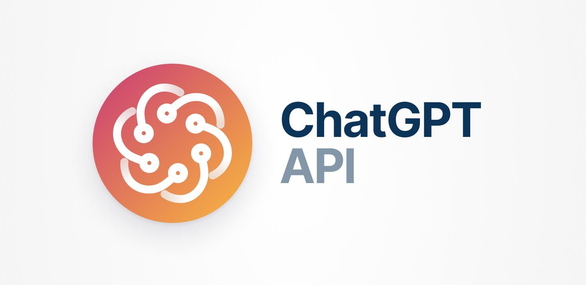
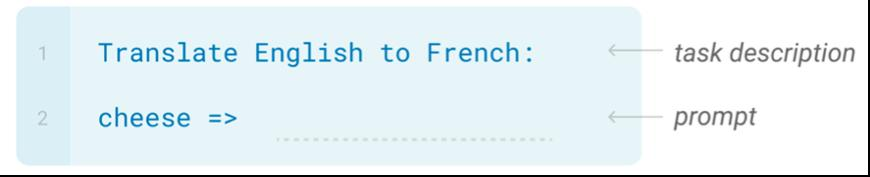
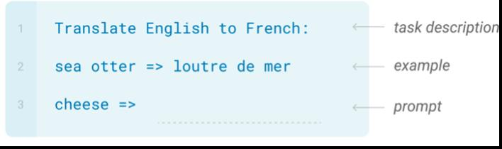
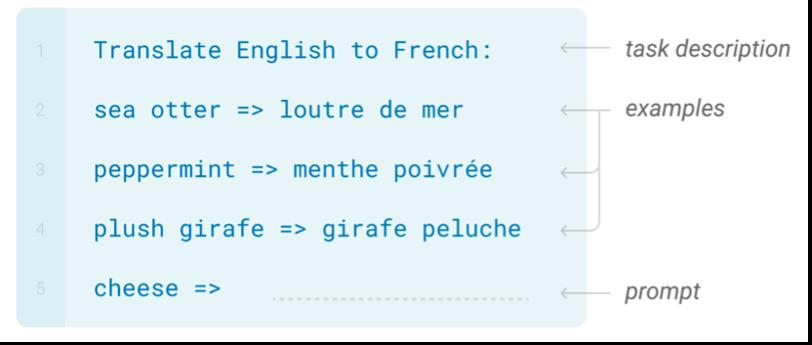

# Introduction

ChatGPT (Chat Generative Pre-Training Transformer) is a chatbot model developed by OpenAI, launched in November 2022. ChatGPT is built on fine-tuning a large language model combined with reinforcement learning based on human feedback.

ChatGPT can solve various natural language processing tasks such as text classification, machine translation, question answering, text summarization, and more. From these foundation tasks, ChatGPT is deployed in various fields including education, content creation, healthcare, and more. Moreover, one of the typical problems that ChatGPT can address is inference and problem-solving.

The ChatGPT model is also capable of being compatible and optimized for specific tasks during the prediction process through the method of **in-content learning**. The in-content learning method is constructed through **prompts**, which are understood as input data with the goal of guiding or describing the problem in detail, helping ChatGPT identify the problem to be addressed and optimize the processing domain, thereby achieving better results.

  

There are 3 settings for constructing the prompts as follows:

- Zero-shot: Providing an answer based solely on the description of the problem.

  - Part 1: The problem description.
  - Part 2: Input data (in this case, text to be translated).

  

- One-shot: Providing an answer based on the problem description and a single example for the problem. There are 3 parts:
  - Part 1: the problem description.
  - Part 2: a sample for the problem.
  - Part 3: input data (text to be translated).

  

- Few-shot: Providing an answer based on the problem description and a few sample examples for the problem. There are 3 parts:
  - Part 1: the problem description.
  - Part 2: some sample examples for the problem.
  - Part 3: input data (text to be translated).

  

The effectiveness of having a description and examples for the problem is superior compared to cases when there are no description and examples. Among the three settings mentioned above, Few-shot is more effective than One-shot and more effective than Zero-shot.

Therefore, to effectively utilize ChatGPT for various applications and task, it is important to construct appropriate prompts. In the project, we will build some prompts for a few applications.
